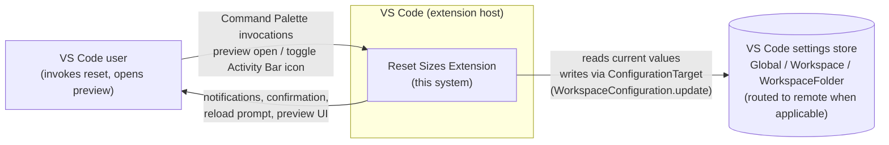
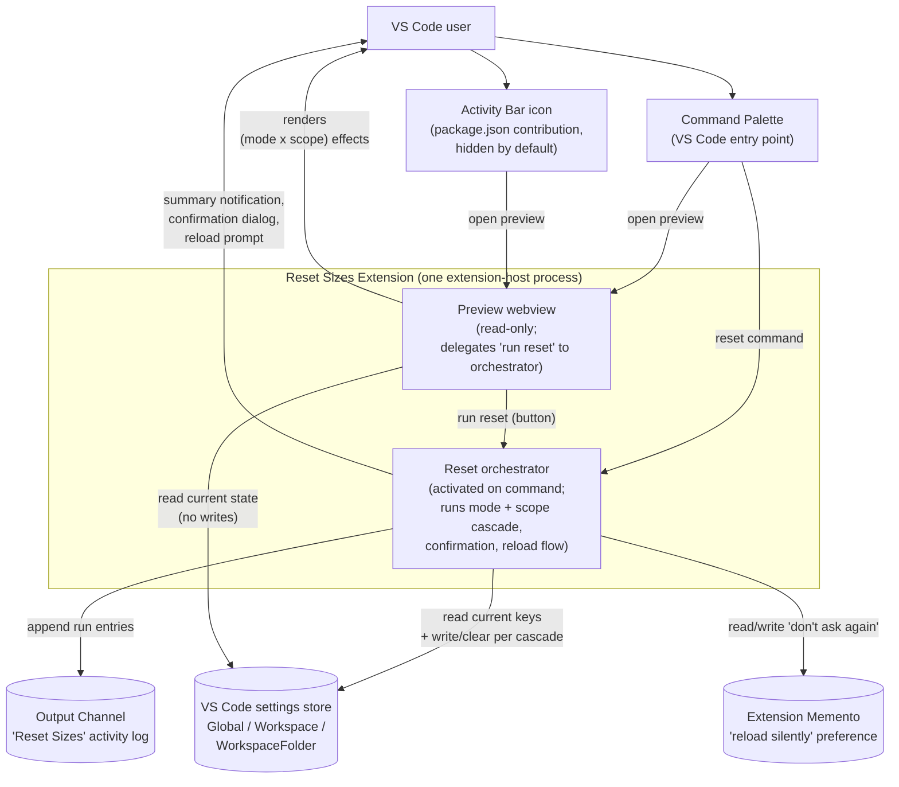

# Architecture Sketch — Reset Sizes (revamp)

Two diagrams: Context (the extension and what touches it) and Container (what's inside the extension at runtime, and what it reads/writes). Behaviour belongs in the Contract; this file shows only the shape.

## Context

Notes:
- "VS Code settings store" is a single external store from the extension's point of view. Remote vs local routing is VS Code's concern, not the extension's (ADR 0002).
- Third-party extensions are not actors here; their settings keys may be cleared when they match the size-family contract (ADR 0003), but no extension-to-extension calls are made.

## Containers

Notes:
- The orchestrator is one container — its internal pieces (size-key discovery, cascade resolution, reload detection) are components and are out of scope for this Sketch.
- The Preview webview never writes state; its only path to an action is delegating to the orchestrator's reset command (ADR 0005). Confirmation and reload flows are owned by the orchestrator and are reached the same way regardless of entry point.
- The Output Channel is a write-only sink from the orchestrator's perspective; the user reads it via VS Code's Output panel.
- The Memento is the only piece of persisted extension-owned state; size-family settings live in VS Code's settings store, not here.
